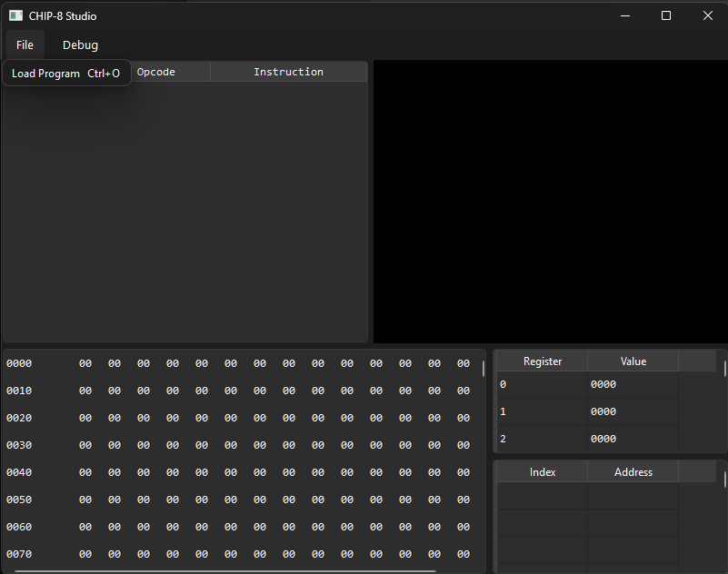
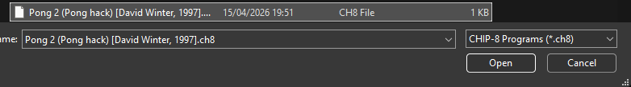
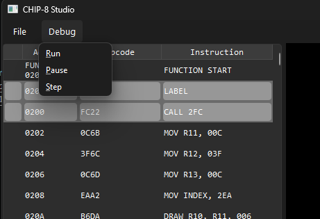
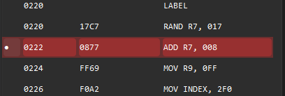
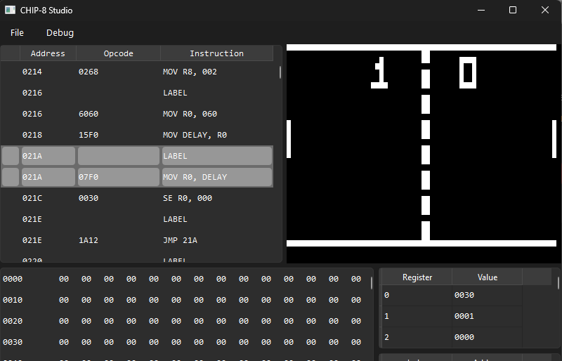

# CHIP-8

A CHIP-8 systems project for decoding, encoding, disassembling, assembling and interpreting CHIP-8 programs.

This project is still in active development.

## What Works

- Instruction decoding
- Instruction encoding from machine instruction IR
- Control Flow aware disassembly with function and basic block output
- Core Interpreter with virtual memory, registers, timers, keypad and display.
- Qt based UI application for multi-use visual inspection of a CHIP-8 program with the ability to pause, single step, breakpoint, inspect memory/registers/call stack, view live disassembly and hex view

## In Progress

 - Assembler with AST representation
 - Higher level intermediate representation for intermediary steps

## Requirements

- CMake 3.10 or newer.
- A C++ 20 compiler.
- Qt 6 Wdigets is required for chip8-studio

## Usage

### Dissassemble a program with chip8-disassembler-cli:

```bash
chip8-disassembler-cli.exe program.ch8
```

Example output:
```
CODE:0200  FUNCTION_0200 START
CODE:0200    12 A5    MOV IDX, 584
CODE:0202    84 61    MOV R1, 000
CODE:0204    00 62    MOV R2, 019
CODE:0206    19 D1    DRAW R1, R2, 005
CODE:0208    25 A5    MOV IDX, 588
CODE:020A    88 62    MOV R2, 00D
CODE:020C    0D D1    DRAW R1, R2, 005
CODE:020E    25 A4    MOV IDX, 441
CODE:0210    41 62    MOV R2, 001
CODE:0212    01 D1    DRAW R1, R2, 005
CODE:0214    25 A5    MOV IDX, 513
CODE:0216    13 61    MOV R1, 031
CODE:0218    31 62    MOV R2, 00E
CODE:021A    0E D1    DRAW R1, R2, 004
CODE:021C    24 A4    MOV IDX, 444
CODE:021E    44 62    MOV R2, 009

CODE:0220  LABEL_0220:                           ; -> 022E
CODE:0220    09 61    MOV R1, 0FF

CODE:0222  LABEL_0222:                           ; -> 0228
CODE:0222    FF 71    ADD R1, 007
CODE:0224    07 D1    DRAW R1, R2, 002
CODE:0226    22 31    SE R1, 022

CODE:0228  LABEL_0228:                           ; -> 0200
CODE:0228    22 12    JMP 222

CODE:022A  LABEL_022A:                           ; -> 0222
CODE:022A    22 32    SE R2, 009

CODE:022C  LABEL_022C:                           ; -> 022A
CODE:022C    09 12    JMP 232

CODE:022E  LABEL_022E:                           ; -> 022A
CODE:022E    32 62    MOV R2, 015
CODE:0230    15 12    JMP 220
```

#

### Inspect a program with chip8-studio:




